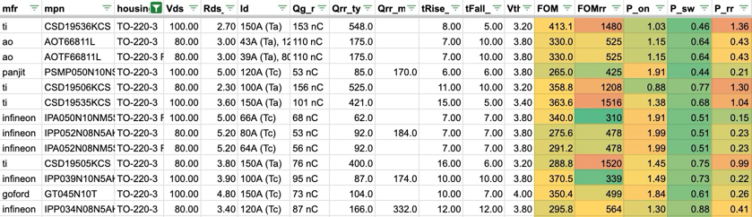

# Extensive parametric search of MOSFETs for DC-DC converters



Finding the right switches for your DCDC-Converter might be not as straight forward as it looks on first sight.
Both switches operate in rather different conditions and especially the reverse recovery loss appears to be often
overlooked. This program tries to help you with the selection.

What it does:

- Read search results from part suppliers
- Download parts datasheets in PDF
- Extract specification values from the PDF files
- Store gathered parts specifications in a database or CSV file
- Compute power Loss estimation for a given DC-DC converter

It builds a parts table with additional fields to those you will usually find in parametric search:

* `Qgs`, `Qgd`, `Qgs2`, `Qg_th`, `Q_sw`
* `V_pl` (miller plateau voltage)
* `C_oss`
* `Qrr`
* rise and fall times

# How to use

```
git clone --recurse-submodules https://github.com/fl4p/fetlib
cd fetlib
pip install -r requirements.txt
git clone https://github.com/open-pe/fet-datasheets # fetch set of data-sheets (80,100,150V power mosfets)
```

1. acquire a parts list from Digikey. go to [digikey.com](https://www.digikey.de/en/products/filter/transistors/fets-mosfets/single-fets-mosfets/278)
2. narrow down the search filters so your have 500 or less results.
3. download the CSV file (click *Download Table* / *First 500 Results*)
4. save the CSV file under `parts-lists/digikey/` folder

5. Open `main.py` and adjust adjust the DCDC operating point:

```
# buck converter
dcdc = DcDcSpecs(vi=62, vo=27, pin=800, f=40e3, Vgs=12, ripple_factor=0.3, tDead=500e-9)
```

```
vi              input voltage
vo              output voltage
pin             input power, alternatively you can set `io` (I_out) or `ii` (I_in).
f               switching frequency
Vgs             gate drive voltage for both HS and LS
ripple_factor   peak-to-peak coil current divided by mean coil current (assuming CCM)
tDead           gate driver dead-time (happens 2 times per period)
```

6. Run `python3 main.py` and it will download all datasheets (if not already found), extract values and compose a CSV
   file with loss estimations for the given DC-DC converter.

   The process will finish with an output like this:

```
written fets-buck-62V-27V-30A-40kHz.csv
stored 1259 parts
```

The CSV file includes these power loss values:

```
P_on        HS conduction loss ~ (D * I² * Rds)
P_on_ls     LS conduction loss ~ ((1 - D) * I² * Rds)
P_sw        HS switching loss ~ max(tRise + tOff, 2 * Qsw / (Vgs / rg) )
P_rr        reverse recovery loss when used as LS (sync fet) ~ Qrr
P_dt_ls     LS dead time loss ~ (tDead * Vsd)
```

And these aggregated power values for the 2 slots HS, LS and for the 2p case each:

```
P_hs        total loss caused by HS switch
P_2hs       total HS loss with 2 parallel switches

P_ls        total loss in LS switch
P_2ls       total LS loss with 2 parallel switches
```

If a input value for power computation is missing the power values will be `float('nan')` (empty CSV cell).
Vsd (body diode forward voltage) defaults to 1 V if not available.

See the equations in [powerloss.py](dslib/powerloss.py).

# Acquiring part specifications

The program collects part specification values from different sources:

- Values from search results (Rds_on, Qg, Vds)
- Manual fields from `dslib/manual_fields.py`
- Nexar API
- PDF Datasheet
    - Text regex
    - Tabula
        - Table header aware iteration
        - Row regex iteration
    - LLMs (TODO)
      - OpenAI´s ChatGPT
      - Anthropic´s Claude 3.5 Sonnet

Values for Rds_on and Qgd are usually shown in the search results (Digikey, LCSC).
Nexar API doesn't show the Qrr, and (tRise+tFall) only for some parts (especially values for newer chips are missing
here).
So I found the only way is to extract Qrr from the Datasheet.
We use 3 techniques:

1. Convert the PDF to txt and find the values with regular expressions. this can be tedious work, as table structure is
   not homogenous across manufacturers and some manufacturers use different formats across product series and release
   date. each extracted field usually requires its own regex since tables include testing conditions or design notes.
2. use tabula (or another pdf2table program) to read the tables from the PDF. there is a python binding available that
   produces pandas DataFrames. find values by iterating the rows.
3. LLM Apis https://github.com/piotrdelikat/fet-data-extractor

## Datasheet download

Downloads for some datasheet are protected by anti-robot mechanism.
To avoid this, we use pyppeteer (Python port of puppeteer) with Chromium to simulate human user interaction.
This will handle JS challenges, redirects and if the link points to a PDF-Preview page, we look for a download button
and
click it.

Chromiums PDF must be disabled, because we cannot access it through pupeteer.
`chromiumUserDataPath/Default/Preferences`:

```
"plugins": {"always_open_pdf_externally": true},
```

## Troubleshooting

- Tabula on macos: I had some issues getting java running on Mac M2, use zulu JDK

# Power Loss Model

The power loss model for a DC-DC buck is based on
this [rOHM AN](https://fscdn.rohm.com/en/products/databook/applinote/ic/power/switching_regulator/power_loss_appli-e.pdf).
We assume CCM mode, coil current never touches
zero.

Note that loss from LS reverse recovery `P_rr` is dissipated in HS.
In other words, poor performance of LS heats up the HS.
The generated CSV file includes the estimated losses caused by a transistor when placed in the HS or LS slot (not their
power dissipation).

Good Mosfet Properties:

HS:

* Fast switching
* Low Q_sw.
* Low r_g

LS:

* Low Q_rr
* Low Qgd/Qgs ratio
* High/optimized Vth
* Low r_g
* Low Vsd

The LS low Vsd problem can be tackled with a short dead time or by placing with a Schottky diode parallel to the LS.
Take
care about parasitic inductances between the LS and the Schottky diode. This might even lower reverse recovery loss,
because the LS body diode never powers up.
See [Toshiba Product Guide 2009](https://www.mouser.com/datasheet/2/408/toshiba%20america%20electronic%20components,%20inc._bce008-1209380.pdf#page=18)
on page 18.

## Notes about Qrr

Qrr is often defined by design and values from the data-sheet are not subject to production test.
Qrr depends on temperature, reverse voltage V_R, forward current I_F and forward current transient dif/dt.
Most datasheets only specify a single value under some given conditions.
DS of IQD016N08NM5 includes one for dif/dt=100A/us and dif/dt=1000A/us

# Acquiring Parts Lists from Suppliers (Search Results)

* Digikey: use the filters to reduce number of results to 500 or less. then export csv
    * N-Ch, 80V, Idc>25A, Qg<250nC, RdsON<
      10mOhm [453 results](https://www.digikey.de/de/products/filter/transistoren/fets-mosfets/einzelne-fets-mosfets/278?s=N4IgjCBcoGwAwyqAxlAZgQwDYGcCmANCAPZQDaIAzAOwAcAnIyALpEAOALlCAMocBOASwB2AcxABfIgCYEtJCE7cAqsMEcA8mgCyeDDgCu-PCCIHuANVMgAtiO6041mxgAe3MHCdSQ06TGkFJUgQAGFiAzYsPAATVXUtXX0jEzNuYVDnN25pAFZvCQkgA) [80V 26A 10mOhm 250nC.csv](parts-lists/80V%2026A%2010mOhm%20250nC.csv)
    * [100V](https://www.digikey.de/en/products/filter/transistoren/fets-mosfets/einzelne-fets-mosfets/278?s=N4IgjCBcoGwAwyqAxlAZgQwDYGcCmANCAPZQDaIAzAOwAcAnIyALpEAOALlCAMocBOASwB2AcxABfIvFpIQqSJlyES5EACY4YMAFY4IImBja4lAyGoAWWnTNFqO%2BnB3VzdWpR13wx7a%2BmWRoHmuvS0YN5GlLqyRJb0MInelpZ6cP4gMIEwOurmWUaOITDRtPqGxrSWeRWa6jU%2BXuoQFU06blmaiHEJiRkFOS2NlJSW5npg8eUgljnqKR206iXFXpaROaPtFTSz5kuW1HD0%2BQkIDVFOsRYwYdRDiQfXRtSUK0R6KWAN99TUWW4wE5jG4EpRaNsQHpPFZiq86OZrOojkMwB40uMwHBnCd7NZ-pCrDYIfsgTpdG58bcQui4Nd7qk3jTPJpmbkxnFKMd6JDZiNrDSIuEaTBmriZvRwZQGuF6PDEalsd0oVp4kMHE4dBzwLRRdKafFhXE-oFvLLXsleokFWlIQN4vlsnp8m9lkMUjpbj8wVUabLpmjHmbsaZxYG5c8nMjCVTlTAqjAEfYPGBqD8tdUMp91EtEXNDoDNZCgXAc5DoS4MkDU9bDPRU7C6w27WdnXX0jpi04-mHJUt6bcbOKkUdvLZU2OS6LxqqPCE%2B5RhzYrNqgeouZF6PMmUQytjLAGt9ZLVkbPPT%2BqG9OPlYwr2svX5153uAwqLtRNrNc9KLaxYp%2BWs69rq0TzowJJxPmkaMAkYHpNqDhTMqRIeOKmiTAg5jNOs9Dathi5ZrOeGTAeDTWHSSYWF%2BbYgOaCz2FeyRzDRzRZFyWG6F4Dwweo4rmuCM6TLmRDND2yqsRGlI2EU0gMtSHymDEHHAtq1RLOuHEeM0WF1IubjLCyOmlvRGhitUOlAqkUn-BkI6lhZPLusuaZuFq3Z5rkXg6dKkqOkEkL1OoehofMmbeZUOkuF5IlBQ4GT-Hcqk6GUyw6Si4nIloGT1HMDTria3j5Q4Qx0UMRXRRoNCIVhBF0jVUbTPMCD6iJB4lAFB5Klh2SYbuQJWIV2RYt1WJyt18wUq1bwuN101oSkNh4QtwkaLMpaNWt2mtU01zzPGLWre14mHPAhWer4WHnWil2JKyInJfyl10L5924bhpJyjuGjwLk7rJQkeXGIE2r2oDyIMFhorUE4kPIo%2BIklND2VZHou1ZKYPyDp6kO-YD5EBYkuh4a8F0iST11k28QJYWmLiFVYKM014Llk8zxOis4NPxqmNN0FqvMQrtfwQmhwvwDTi3E5KwQiXuX3%2BuxsvnBk4R8rtNgIGVGvXjMy4zbLqt5QwWgBcbRhYQwnqFU4ER4fWaLDslryNVu2LW9Ek0aJKjxYYwTu%2BzyMMiX78NUPudVEFyxwCZHWiTEMXKBg0XJBcNselMnpgeNqG7ouYXLrDHYfWOb0gQti%2BTl%2BK8bktMNfaPkRzJT8IbePa0xHPACHfHA3fQ%2BqmgyRYaYvrcjA0G4VQ0e4xygqm6oJN8oLhCrNBlPsa%2Br%2B4G-Pfsnz9GcAq7vAkz7Cj1xOKYcZytDkJOIEGTAvUfklOKVxnkQ9Zcm-uj-OY9Ymn-pZBouEMz-zcnfZKRoQAJFmFWEMQUQgIOVFiOkRdUGMAQo4dSSDbaRC0AwMMzg-goOIX8JBHNnjNVDlieM69DAIFoNArERwmD2FyFYYsWIXDXAGAdEwEJVzaHjiEbQqQhGTBBPYUcoFDB%2BEVuAEiCixHrCrEo3h2QRiiOPKiXQrpRHhDTrrE0KC0QeEiKRLa4BLFVlIrI6xpYDqpBsBpXcvdDhhkCKEREy54whECLkCxdRUSpF0HGTRq5Uh-GLIcBmL9PD%2BPCC%2BaGuoXoWGWPKQwegXDTFlIcZ4XhRiREKVZBiUUAxak1jOGEw54y8WLJ6CEDxNG8ITNDREowljIQyV9IwilVJWhlJIz2RgsQ81qBuYoyJS60SxLMVcWQDx8WGauJYtCaTNAjsYqwB94BSJmFYOoL8CwBCCCDFIj1WAgE4NwPgQgxCSGkEvaA8h0DYHwEQUgkAKCFwQOKXIPJvyqneh8XiL4AWvHGLxRsFgwRbihUFD8lTyyVO-FqZ%2BHx0VjhTDCj0Rxpjor-ASPZHkDKuWBEMKKPJl63AJdzLMkp9ZQm9pS725ZvbfklCzXW0zJzAl4Swuu2QIKZBYXaFhcYWHVybnOJ5dJxSITUqcLc8L7B1IBNIHMiC4iKlcZkHMCjRR501R4ZUqQvC9X1ZMC48YDzPFtUYowVRqYVCqPMYobrbJLHuOmFSbgqZ6u%2BOSSiQa0SRFThDNxKQg7gFTqq2ZuEP6xvJNSwwywqhVnTTRb4NcUFZueOm8W0hcLQwaCUKGHcSzcu%2BILMMZYaH1oLbqCuabm2rijmwzI8AAEhETukXtccAyJwiAO74FxE7up1XzZUtde5DrRJ2F%2Bupe2BjHF%2BSN4BSiQsMFu9taI-47v3c8UoK0lh0j1TZHkKCRiBJtMZXtnhlE3vlu41Nm7PDrAfVqfo2Rt3pMTCZW2twqyjHxb2w4lrbZHBAxBsMoHHXwdRG8Ok17u1IeMPZHdGHIhU1nlhkwHTuTtscMiXtFpx0Wnba8A8ZHRhUdGOEl47bbjkiwqWeYAV2OsZElxvKXHOM5T4zlPC7G-xlGjeJdj9w2P1EonUOGMmtUhHuDyC4Kmi3gHU6idTKD1MaJeGp-qhmUzKajtpqOq5nZL0MFZyzidyyoJlppxOzxnZ3Wc%2Bx0zpZdMHlKTcNMDobMHgqqmYLYYrAICrBFv9qZoS6c%2BNpz4xYHDOADCl-mNmobJaNQhfEb6ay8RlJoNZynRT5f%2BFHUrXJ4uC2UxaKL1HtPUcAtUfZhw1xqdeIumzXXXNdfC9nSIthcjKfRJZ9EUX0R9cYLpr%2Bln6x7Bswt8L9Zs39w0w4H6Y4x6ewSvWMMe5fSGEOygvcMa0TYnjRd7kNItBaH0rqJht3uHPcg2ULEzx3uOpSQkmKZRRg6XE3hHMzg8og4qvUMo3XMjCrHOkPcgOcSI405D84yPu7djKiDvxf2-lsa8GEfHB4yrOFIkT0w5PpVauyqTz2XRviFU1vY%2BnE8eNA0aprJz9PP1s8mDT4wLFNbcY0ELxnAu4z3FyMhKcaFGH7K6I9tj8ZpNs5sGL6SSubCSeV7tRh7TVf0IlHQEdBvLzdkZylmnKXZfFUkw4Kxmh7ecftzTqovc2NusZ26zjVQAc8d95J33ruUh8aqItkXYfg9Hwj4qD3qQ%2BOSiLpoaWbcYJJuT4ZHjjLGeMvEmMhwHEsrxUCAwPPBC0JjJjZsoEhUxW147BX9IOtNn-DL-8XaLCC8iW4afbv8cFXck5uw%2BIfuNBiN%2Bwc74nb5hMN4t1JhSevzmVakw6HM-dRlS-C%2BD0WhjpMMTPPmwm%2BmEwv%2B2qQskWaoobKlyXU4lb-cviMbgKD%2BPyObyg-5CdCFHrkkY1aIsw7oio4ylUki2UABOOoBhwH%2BfOhU0QjkNUZIeE8BQ8v%2BcoMBcoyB-U9%2B64OQNU64hu64BBcBUcH%2BUc4BUcu0IwccNUicJBqo%2Bk1WVBLmtBpYN%2BLIyBLIzBXEtBTQvBJk64bUH%2BB4MKghTeNUIhaEdG%2BulU0acB0ayB0aVBio-%2BT%2Bf00kqhn0EhmBbgCAjSkMtw8uiQcoDwaY4QhUxhK0ywg41wCseElhw4Km7m1hjAgMY8Y4yI8wbhjAyMY8aMY8CqEQEQgM%2BK4kiY2I2U5IH2l0wiZUURdO8RtSSwaSqcnokRv8Z0v8w4wBZ0myaEv0Dc90zQveGgBR%2BRQUOYl0FR5RPBRRXgAUnkX0FRWocRiKZ0384kFq0%2BXEQ%2BpRHsjUXEhRfR2g7R2g%2BR0QzhXEzOUxeEUxnR0QrO-4CxcREBl0bw6ez4T290bwY02xRweUqK%2BRSy-QZhc%2B90gQ-a5xBG5x5El0C0DRC0M6jmZ0Shdx0Sbx5Caqt8DxwsmI%2B4sx%2BSRscyuSei0COYcyaE4Qzgps3C2UUJL44JCAeE8JMJCA4k8JWYjmqJohUJcmuJkJH26JH2yMDAIB6aW4gMko2q30ieFhieaMieaEtwowZUzJfmyw0sDJOQXJGqNJiQgEdAkBmUWgZaZhCihcAKNM2Ik6VEDsosSJ9MehAUncKOncRwUpiYeUap5yTqjUap4kap8p3MGpVhncIq0ydIxMo0Wpo0H4vc1hUpPIbcYpZU9wNAY4BEZJvwppqY6e3pQsqYVevwKRaYdIypyeWpGevs5qu0oCzecZAUoCKuXsUSdsUS2USZaEoCYJ2ZGZqQocvE%2BZ1sa0Lsa01croXemQFZWsywTKWqJhFs0KZo8wzsjZYQRsvEy6PQiQ4e9Z8afZpsBqyJ0oWxGgWkMaswHCpsPkhU45050KFs1BjU6INEBwrwRsnga%2BK56Jm5cJm5CqnpO5%2BhssbUWsbUcJIhZ58OFsdqy5dqV5sqY5Syd5YyN56yJ5LCN5gBX5CJYeQpkeRsKQf6OYQFhI2CpGJ5fws5%2BSd5dARsP4cJeg3KZY8EFsSFyE66-QxIwF5cnxY5SFthJYWiaqs%2BkJFqWsFqiF38aFHsNFJu%2BF0QyoXIgSkIzFBB%2BcoO2MscUuyQKmFMYcUudoVgYiHFHCmcHCGQbFlEbFhubFMaclYwVyNykAvAAgIg4gUgr4EMLyCgSgHyqg3yGg5g0wilmlCucgul7yKgXyFAqCAABAAGosDsBcAqUACqwgggHAAA8mgAALJ4AYA4AACu-AeAjypk04LyylIAAAwsQMFWwFgHgAACYeVeW%2BUBVBWhXhVEDBXcDCCxXmAAC2GAAAHtwEFPoBIJpYgC8oICldwAALSvkuXcDmAcAACebA4VKlQVqANVQAA)
* LCSC: use Browser Developer Tools to copy HTML DOM of each results page.

# TODO

* Use other part list sources
  * https://eu.mouser.com/api-search/#signup
  * https://www.infineon.com/cms/de/design-support/finder-selection-tools/product-finder/mosfet-finder/
  * https://www.mccsemi.com/products/mosfets/power-mosfets

* Coss power loss
* Use ocr (sample 'BUK7E4R0-80E,127.pdf', 'IPB019N08N3GATMA1' ) `ocrmypdf` can recover the text, but doesn't recognize
  symbols
  correctly.
* Mouser, API?
* Winsource
* Extract more fields
    * Qgd/Qgs (self turn on)
    * Vsd (body diode forward voltage)
    * r_g

# Resources

* https://www.discoveree.io/
*
    * https://epc-co.com/epc/design-support/part-cross-reference-search
    * a very useful tool that comes with power loss calculations. i found some values to be off, e.g. IPA050N10NM5S
      Rds_on_max@10V is 5, in the app its 5.6.

* https://octopart.com/ (Ciss, rise&fall times, )

https://www.discoveree.io/collateral/continental/PCIM2020_DiscoverEE_PowerLossModeling_AudioVisual.mp4
https://www.discoveree.io/collateral/PCIM_Europe_2020/PCIM2020_DiscoverEE_PowerLossModeling_Slides.pdf
https://pcimasia-expo.cn.messefrankfurt.com/content/dam/messefrankfurt-redaktion/pcim_asia/download/pac2020/speakers-ppt/1/Shishir%20Rai.pdf
https://ww1.microchip.com/downloads/en/Appnotes/01471A.pdf
https://www.st.com/resource/en/application_note/dm00380483-calculation-of-turnoff-power-losses-generated-by-a-ultrafast-diode-stmicroelectronics.pdf
https://www.vishay.com/docs/73217/an608a.pdf
https://www.eetimes.com/how-fet-selection-can-optimize-synchronous-buck-converter-efficiency/

# names

fetlib
mosfetlib
fetfinder
findfet
mosdb