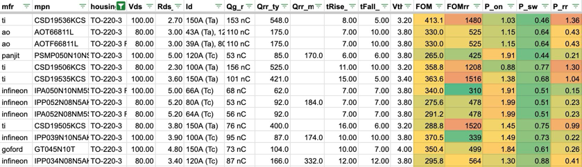

commands
- discover parts
- download datasheets


I’ve been working on this the last years.
It is 3 projects in one repo:

1) mosfet datasheet parser and advanced parametric search
2) power mosfet power loss modelling using gate charge curve
3) inductor core loss

If you’ve been looking for power switches for your dc-dc converter you probably know. there are plenty of good products
but which one to choose.

What fetlib does:

1) scrape manufacturer websites for parts (currently TODO)
2) download parts pdf data sheet
3) read the data sheet and normalize specifications

the data sheet reading uses several techniques:

1) a simple pdf2text and then regex approach. pdf does not understand tables and not even fluent text, each
   character[README.md](../../heliosync/hw/sensor/debug-probe/README.md)
   has its own bounding box with coordinates absolute to the page origin. this ensures that pdfs are rendered perfectly
   equal without using the character width of the font.
   the first step here is too aggregate characters into words, words into lines, lines into blocks/paragraphs. care must
   be
   taken with subscript and superscript, so it doesn’t end up in another line.

2) find tables using tabula. this works ok. due to the nature of data sheet tables that contain a lot of merged
   vertically and horizontally merged cells, and sometimes frame-less tables/cells.

3) spatial query: this is somewhat a new invention, a mix of regex search and 2d-raytracing.

we also been throwing LLMs (from openai and anthropic and sth open source) in but we couldn't find any advantage as
compared to regex. They sometimes produces arbitrary
errors, which can easily stay un-detected. LLMs are non-deterministic behavior and insane waste of energy.

Once the data is extracted, the program does some range checks on the values, especially with the gate charge
parameters.

datasheets/toshiba/SSM6N15FU.pdf

# Extensive parametric search of MOSFETs for DC-DC converters



This toolset tries to help you with designing a DC/DC converter.

It basically consists of three parts:

1) FET data sheet parsing (download, normalisation, validation)
2) Magnetic materials library and tools for DC-biased inductor design
3) Power loss modeling of switching, inductor, capacitors

What it does:

- Read search results from part suppliers
- Download parts PDF datasheets
- Extract specification values from the PDF files
- Store gathered parts specifications in a database or CSV file
- Compute power Loss modeling for a given DC-DC converter load point

## Switch Loss Intro

You can start by defining your DC/DC load parameters, `DcDcLoadParams`, currently synchronous buck converter only:

* Input voltage (Vin)
* Output voltage (Vout)
* Output current (Iout)
* switching frequency
* Ripple current (peak-to-peak) OR ripple factor OR DC-biased inductivity
* Gate Drive
    * Gate drive voltage
    * Gate drive resistor

It will then start to discover mosfets directly from manufacturers websites (current implemented: TI, Infineon, Toshiba,
ST, onsemi, vishay, nexperia/nxp, huayi, Alpha&Omega, TaiwanSemi, Qorvo) or Digikey search results.

After pre-selecting for breakdown voltage and drain current, it'll start downloading the data sheets.
Once this is done, it processes the data sheets with different methods (see below TODO) and generates a normalised data
sheet object. Out of this data sheet object we create the MOSFET specifications, which describes the parts Rds_on, gate
charge curve and other parameters:

* `Qgs`, `Qgd`, `Qgs2`, `Qg_th`, `Q_sw`
* `V_pl` (miller plateau voltage)
* `C_oss`
* `Qrr`
* rise and fall times

With the given DC/DC load parameters and gate drive parameters mentioned earlier, we compute gate charge
curve for the high-side (HS) and low-side (LS) switch. With the gate charge we estimate power loss during (dis-)charge
of the gate-source and miller capacitance. We also consider revers recovery losses of the synchronous rectifier (buck:
LS) body diode.

This way we can rank all mosfets by their power loss in the HS or LS slot. This is expected to be much mure accurate
than
using the Figure-of-Merit `Rds_ON*Qg`.
The model was used during the design process of a 1 kW MPPT tracker (Fugu2) and we fed back real-life experience into
the model. Proper verification still needs to be done (measuring real gate drive curve, reverse recovery effect).

The power loss computation currently lacks a temperature rise model.

References:

- Fundamentals of Power Electronics
- Discover.ee
- TI AN
- Infineon AN
- Rohm AN

## How to use

- python3.9
- tabula (`sudo snap install tabula`, https://github.com/tabulapdf/tabula/releases/download/v1.2.1/tabula-jar-1.2.1.zip)
- fontforge
- poppler (`sudo apt-get install -y poppler-utils`)
- tesseract
- ghoscript 9.55 or higher ( https://askubuntu.com/questions/1076846/how-to-install-newer-version-of-ghostscript-on-server-than-provided-from-ubuntu )

```
git clone --recurse-submodules https://github.com/fl4p/fetlib
cd fetlib
python3 -m venv venv
. ./venv/bin/activate 
pip install -r requirements.txt
# fetch a set of data-sheets (mostly 80-200V power mosfets):
git clone https://github.com/open-pe/fet-datasheets datasheets

# additional dependencies:
- `gs` (Ghostscript)
- qpdf
- sips
- CUPS_PDF (www.cups-pdf.de/)
- Tabula
- FontForge
```

1. acquire a parts list from Digikey. go
   to [digikey.com](https://www.digikey.de/en/products/filter/transistors/fets-mosfets/single-fets-mosfets/278)
2. narrow down the search filters so your have 500 or less results.
3. download the CSV file (click *Download Table* / *First 500 Results*)
4. save the CSV file under `parts-lists/digikey/` folder

5. Open `main.py` and adjust adjust the DCDC operating point:

```
# buck converter
dcdc = DcDcSpecs(vi=62, vo=27, pin=800, f=40e3, Vgs=12, ripple_factor=0.3, tDead=500e-9)
```

```
vi              input voltage
vo              output voltage
pin             input power, alternatively you can set `io` (I_out) or `ii` (I_in).
f               switching frequency
Vgs             gate drive voltage for both HS and LS
ripple_factor   peak-to-peak coil current divided by mean coil current (assuming CCM)
tDead           gate driver dead-time (happens 2 times per period)
```

6. Run `python3 main.py` and it will download all datasheets (if not already found), extract values and compose a CSV
   file with loss estimations for the given DC-DC converter.

   The process will finish with an output like this:

```
written fets-buck-62V-27V-30A-40kHz.csv
stored 1259 parts
```

The CSV file includes these power loss values (see [Power Loss Model](README.md#power-loss-model) for details):

```
P_on        HS conduction loss ~ (D * I² * Rds)
P_on_ls     LS conduction loss ~ ((1 - D) * I² * Rds)
P_sw        HS switching loss ~ max(tRise + tOff, 2 * Qsw / (Vgs / rg) )
P_rr        reverse recovery loss when used as LS (sync fet) ~ Qrr
P_dt_ls     LS dead time loss ~ (tDead * Vsd)
```

And these aggregated power values for the 2 slots HS, LS and for the 2p case each:

```
P_hs        total loss caused by HS switch
P_2hs       total HS loss with 2 parallel switches

P_ls        total loss in LS switch
P_2ls       total LS loss with 2 parallel switches
```

If a input value for power computation is missing the power values will be `float('nan')` (empty CSV cell).
Vsd (body diode forward voltage) defaults to 1 V if not available. `V_plateau` (miller plateau voltage) defaults to
4.5V.

See the equations in [powerloss.py](dclib/powerloss.py).

# Outputs

We pick a set of switches for LS and HS, inductor and capacitors. Then we compute loss for different output currents and
plot the results like this (the plot includes loss in switches, inductor, capacitors):


# Acquiring parts list

A good starting point to discovery suitable switches is the DigiKey parametric search (see above how to import CSVs).
To include the latest and greatest products, you need to go to the manufacturers' website.
We implemented automated discovery of new products for Infineon, Toshiba and TI,
see [`dslib/parts_discovery.py`](dslib/discovery/parts_discovery.py).

# Acquiring part specifications

The program collects part specification values from different sources:

- Values from search-results / parts-lists on supplier website or manufacturer website (Rds_on, Qg, Vds)
- Manual fields from `dslib/manual_fields.py`
- Nexar API
- PDF Datasheet
    - Text regex
    - Tabula
        - Table header aware iteration
        - Row regex iteration
    - LLMs (TODO)
        - OpenAI´s ChatGPT
        - Anthropic´s Claude 3.5 Sonnet
        - flux.ai (TODO)

Values for Rds_on and Qgd are usually shown in the search results (Digikey, LCSC).
Nexar API doesn't show the Qrr, and (tRise+tFall) only for some parts (especially values for newer chips are missing
here). So we need to extract characteristics for the power loss model from the Datasheet.
We use 3 techniques:

1. Convert the PDF to txt and find the values with regular expressions. this can be tedious work, as table structure is
   not homogenous across manufacturers and some manufacturers use different formats across product series and release
   date. each extracted field usually requires its own regex since tables include testing conditions or design notes.
2. use tabula (or another pdf2table program) to read the tables from the PDF. there is a python binding available that
   produces pandas DataFrames. find values by iterating the rows.
3. LLM Apis https://github.com/piotrdelikat/fet-data-extractor

### Field priority

1. manual fields
2. pdf2txt + regex (first symbol)
3. tabula + regex (first symbol)
4. Fallback specs (GaN)
5.

For the power loss compution we need a single discrete value of relevant fields (e.g. `Rds_on`, `Qsw`, `Qrr`).
Datasheet specify min./max/typ values and sometimes there are multiple rows for a single value under different
testing conditions e.g. temperature, Vdd, Id, and transients di/dt and dv/dt.

|            |        |             |   |
|------------|--------|-------------|---|
| Rds_on     | Vg=10V | max         |   |
| Qg         |        |             |   |
| tRise/Fall |        | typ,max,min |   |
|            |        |             |   |
|            |        |             |   |
|            |        |             |   |
|            |        |             |   |

## Benchmarking pipelines

- only take those sybmols relevant for power loss model
- Score Funcs
    - count fields: count symbol with any min/typ/max value
    - rmse:
        - define a reference Datasheet
        - for each relevant symbol -> Sym
            - for each (min, typ, max) -> Stat
                - Count += abs((A[Sym][Stat] - B[Sym][Stat]) / B[Sym][Stat]) < ErrThres

## Datasheet download

Downloads for some datasheet are protected by anti-robot mechanism.
To avoid this, we use pyppeteer (Python port of puppeteer) with Chromium to simulate human user interaction.
This will handle JS challenges, redirects and if the link points to a PDF-Preview page, we look for a download button
and
click it.

Chromiums PDF must be disabled, because we cannot access it through pupeteer.
`chromiumUserDataPath/Default/Preferences`:

```
"plugins": {"always_open_pdf_externally": true},
```

## Troubleshooting

- Tabula on macos: I had some issues getting java running on Mac M2, use zulu JDK

# Power Loss Model

TODO:

* https://www.infineon.com/dgdl/Infineon-Buck_converters_negative_spike_at_phase_node-AN-v01_00-EN.pdf?fileId=db3a3043338c8ac80133a14f039e4f85
* table showing what losses matter !!
* https://www.ti.com/lit/an/slvaeq9/slvaeq9.pdf#page=5 (compute Vpl, Qoss loss )

The power loss model for a DC-DC buck is based on
the application
notes [rOHM: Calculation of Power Loss (Synchronous)](https://fscdn.rohm.com/en/products/databook/applinote/ic/power/switching_regulator/power_loss_appli-e.pdf)
and [TI: Power Loss Calculation With Common Source Inductance Consideration for Synchronous Buck Converters](https://www.ti.com/lit/an/slpa009a/slpa009a.pdf).
We assume CCM mode, coil current never touches zero.

Note that loss from LS reverse recovery `P_rr` is dissipated in HS.
In other words, poor performance of LS heats up the HS.
The generated CSV file includes the estimated losses caused by a transistor when placed in the HS or LS slot (not their
power dissipation).

## Mosfet Key Parameters for synchronous converters ([src](https://www.mouser.com/datasheet/2/408/toshiba%20america%20electronic%20components,%20inc._bce008-1209380.pdf#page=16)):

### HS (Fast switching):

* Low Q_sw
* Low r_g
* Low Rds_on

### LS (Body Diode Properties, self turn-on prone):

* Low Rds_on
* Low Q_rr
* Low Qgd/Qgs ratio (self turn-on)
* Optimized Vth (self turn-on)
* Low r_g
* Low Vsd

Note that LS losses in the body diode depend on Vsd and the driver dead time.
Consider placing a Schottky diode parallel to the LS. This can reduce voltage drop and the reverse recovery effect.
Take care about parasitic inductances between the LS and the Schottky diode.
See [Toshiba Product Guide 2009](https://www.mouser.com/datasheet/2/408/toshiba%20america%20electronic%20components,%20inc._bce008-1209380.pdf#page=18)
on page 18.

## Notes about Qrr

Qrr can be defined by design and values from the data-sheet are not subject to production test.
Qrr depends on temperature, reverse voltage V_R, forward current I_F and forward current transient dif/dt.
Most datasheets only specify a single value under some given conditions.
DS of IQD016N08NM5 includes one for dif/dt=100A/us and dif/dt=1000A/us.

Some datasheets (infineon, 400V fets) specify `Qfr` mosfet forward recovery, which is the same as body diode reverse
recovery. (TODO verify)

# Acquiring Parts Lists from Suppliers (Search Results)

* Digikey: use the filters to reduce number of results to 500 or less. then export csv
    * [100V](https://www.digikey.de/en/products/filter/transistoren/fets-mosfets/einzelne-fets-mosfets/278?s=N4IgjCBcoGwAwyqAxlAZgQwDYGcCmANCAPZQDaIAzAOwAcAnIyALpEAOALlCAMocBOASwB2AcxABfIvFpIQqSJlyES5EACY4YMAFY4IImBja4lAyGoAWWnTNFqO%2BnB3VzdWpR13wx7a%2BmWRoHmuvS0YN5GlLqyRJb0MInelpZ6cP4gMIEwOurmWUaOITDRtPqGxrSWeRWa6jU%2BXuoQFU06blmaiHEJiRkFOS2NlJSW5npg8eUgljnqKR206iXFXpaROaPtFTSz5kuW1HD0%2BQkIDVFOsRYwYdRDiQfXRtSUK0R6KWAN99TUWW4wE5jG4EpRaNsQHpPFZiq86OZrOojkMwB40uMwHBnCd7NZ-pCrDYIfsgTpdG58bcQui4Nd7qk3jTPJpmbkxnFKMd6JDZiNrDSIuEaTBmriZvRwZQGuF6PDEalsd0oVp4kMHE4dBzwLRRdKafFhXE-oFvLLXsleokFWlIQN4vlsnp8m9lkMUjpbj8wVUabLpmjHmbsaZxYG5c8nMjCVTlTAqjAEfYPGBqD8tdUMp91EtEXNDoDNZCgXAc5DoS4MkDU9bDPRU7C6w27WdnXX0jpi04-mHJUt6bcbOKkUdvLZU2OS6LxqqPCE%2B5RhzYrNqgeouZF6PMmUQytjLAGt9ZLVkbPPT%2BqG9OPlYwr2svX5153uAwqLtRNrNc9KLaxYp%2BWs69rq0TzowJJxPmkaMAkYHpNqDhTMqRIeOKmiTAg5jNOs9Dathi5ZrOeGTAeDTWHSSYWF%2BbYgOaCz2FeyRzDRzRZFyWG6F4Dwweo4rmuCM6TLmRDND2yqsRGlI2EU0gMtSHymDEHHAtq1RLOuHEeM0WF1IubjLCyOmlvRGhitUOlAqkUn-BkI6lhZPLusuaZuFq3Z5rkXg6dKkqOkEkL1OoehofMmbeZUOkuF5IlBQ4GT-Hcqk6GUyw6Si4nIloGT1HMDTria3j5Q4Qx0UMRXRRoNCIVhBF0jVUbTPMCD6iJB4lAFB5Klh2SYbuQJWIV2RYt1WJyt18wUq1bwuN101oSkNh4QtwkaLMpaNWt2mtU01zzPGLWre14mHPAhWer4WHnWil2JKyInJfyl10L5924bhpJyjuGjwLk7rJQkeXGIE2r2oDyIMFhorUE4kPIo%2BIklND2VZHou1ZKYPyDp6kO-YD5EBYkuh4a8F0iST11k28QJYWmLiFVYKM014Llk8zxOis4NPxqmNN0FqvMQrtfwQmhwvwDTi3E5KwQiXuX3%2BuxsvnBk4R8rtNgIGVGvXjMy4zbLqt5QwWgBcbRhYQwnqFU4ER4fWaLDslryNVu2LW9Ek0aJKjxYYwTu%2BzyMMiX78NUPudVEFyxwCZHWiTEMXKBg0XJBcNselMnpgeNqG7ouYXLrDHYfWOb0gQti%2BTl%2BK8bktMNfaPkRzJT8IbePa0xHPACHfHA3fQ%2BqmgyRYaYvrcjA0G4VQ0e4xygqm6oJN8oLhCrNBlPsa%2Br%2B4G-Pfsnz9GcAq7vAkz7Cj1xOKYcZytDkJOIEGTAvUfklOKVxnkQ9Zcm-uj-OY9Ymn-pZBouEMz-zcnfZKRoQAJFmFWEMQUQgIOVFiOkRdUGMAQo4dSSDbaRC0AwMMzg-goOIX8JBHNnjNVDlieM69DAIFoNArERwmD2FyFYYsWIXDXAGAdEwEJVzaHjiEbQqQhGTBBPYUcoFDB%2BEVuAEiCixHrCrEo3h2QRiiOPKiXQrpRHhDTrrE0KC0QeEiKRLa4BLFVlIrI6xpYDqpBsBpXcvdDhhkCKEREy54whECLkCxdRUSpF0HGTRq5Uh-GLIcBmL9PD%2BPCC%2BaGuoXoWGWPKQwegXDTFlIcZ4XhRiREKVZBiUUAxak1jOGEw54y8WLJ6CEDxNG8ITNDREowljIQyV9IwilVJWhlJIz2RgsQ81qBuYoyJS60SxLMVcWQDx8WGauJYtCaTNAjsYqwB94BSJmFYOoL8CwBCCCDFIj1WAgE4NwPgQgxCSGkEvaA8h0DYHwEQUgkAKCFwQOKXIPJvyqneh8XiL4AWvHGLxRsFgwRbihUFD8lTyyVO-FqZ%2BHx0VjhTDCj0Rxpjor-ASPZHkDKuWBEMKKPJl63AJdzLMkp9ZQm9pS725ZvbfklCzXW0zJzAl4Swuu2QIKZBYXaFhcYWHVybnOJ5dJxSITUqcLc8L7B1IBNIHMiC4iKlcZkHMCjRR501R4ZUqQvC9X1ZMC48YDzPFtUYowVRqYVCqPMYobrbJLHuOmFSbgqZ6u%2BOSSiQa0SRFThDNxKQg7gFTqq2ZuEP6xvJNSwwywqhVnTTRb4NcUFZueOm8W0hcLQwaCUKGHcSzcu%2BILMMZYaH1oLbqCuabm2rijmwzI8AAEhETukXtccAyJwiAO74FxE7up1XzZUtde5DrRJ2F%2Bupe2BjHF%2BSN4BSiQsMFu9taI-47v3c8UoK0lh0j1TZHkKCRiBJtMZXtnhlE3vlu41Nm7PDrAfVqfo2Rt3pMTCZW2twqyjHxb2w4lrbZHBAxBsMoHHXwdRG8Ok17u1IeMPZHdGHIhU1nlhkwHTuTtscMiXtFpx0Wnba8A8ZHRhUdGOEl47bbjkiwqWeYAV2OsZElxvKXHOM5T4zlPC7G-xlGjeJdj9w2P1EonUOGMmtUhHuDyC4Kmi3gHU6idTKD1MaJeGp-qhmUzKajtpqOq5nZL0MFZyzidyyoJlppxOzxnZ3Wc%2Bx0zpZdMHlKTcNMDobMHgqqmYLYYrAICrBFv9qZoS6c%2BNpz4xYHDOADCl-mNmobJaNQhfEb6ay8RlJoNZynRT5f%2BFHUrXJ4uC2UxaKL1HtPUcAtUfZhw1xqdeIumzXXXNdfC9nSIthcjKfRJZ9EUX0R9cYLpr%2Bln6x7Bswt8L9Zs39w0w4H6Y4x6ewSvWMMe5fSGEOygvcMa0TYnjRd7kNItBaH0rqJht3uHPcg2ULEzx3uOpSQkmKZRRg6XE3hHMzg8og4qvUMo3XMjCrHOkPcgOcSI405D84yPu7djKiDvxf2-lsa8GEfHB4yrOFIkT0w5PpVauyqTz2XRviFU1vY%2BnE8eNA0aprJz9PP1s8mDT4wLFNbcY0ELxnAu4z3FyMhKcaFGH7K6I9tj8ZpNs5sGL6SSubCSeV7tRh7TVf0IlHQEdBvLzdkZylmnKXZfFUkw4Kxmh7ecftzTqovc2NusZ26zjVQAc8d95J33ruUh8aqItkXYfg9Hwj4qD3qQ%2BOSiLpoaWbcYJJuT4ZHjjLGeMvEmMhwHEsrxUCAwPPBC0JjJjZsoEhUxW147BX9IOtNn-DL-8XaLCC8iW4afbv8cFXck5uw%2BIfuNBiN%2Bwc74nb5hMN4t1JhSevzmVakw6HM-dRlS-C%2BD0WhjpMMTPPmwm%2BmEwv%2B2qQskWaoobKlyXU4lb-cviMbgKD%2BPyObyg-5CdCFHrkkY1aIsw7oio4ylUki2UABOOoBhwH%2BfOhU0QjkNUZIeE8BQ8v%2BcoMBcoyB-U9%2B64OQNU64hu64BBcBUcH%2BUc4BUcu0IwccNUicJBqo%2Bk1WVBLmtBpYN%2BLIyBLIzBXEtBTQvBJk64bUH%2BB4MKghTeNUIhaEdG%2BulU0acB0ayB0aVBio-%2BT%2Bf00kqhn0EhmBbgCAjSkMtw8uiQcoDwaY4QhUxhK0ywg41wCseElhw4Km7m1hjAgMY8Y4yI8wbhjAyMY8aMY8CqEQEQgM%2BK4kiY2I2U5IH2l0wiZUURdO8RtSSwaSqcnokRv8Z0v8w4wBZ0myaEv0Dc90zQveGgBR%2BRQUOYl0FR5RPBRRXgAUnkX0FRWocRiKZ0384kFq0%2BXEQ%2BpRHsjUXEhRfR2g7R2g%2BR0QzhXEzOUxeEUxnR0QrO-4CxcREBl0bw6ez4T290bwY02xRweUqK%2BRSy-QZhc%2B90gQ-a5xBG5x5El0C0DRC0M6jmZ0Shdx0Sbx5Caqt8DxwsmI%2B4sx%2BSRscyuSei0COYcyaE4Qzgps3C2UUJL44JCAeE8JMJCA4k8JWYjmqJohUJcmuJkJH26JH2yMDAIB6aW4gMko2q30ieFhieaMieaEtwowZUzJfmyw0sDJOQXJGqNJiQgEdAkBmUWgZaZhCihcAKNM2Ik6VEDsosSJ9MehAUncKOncRwUpiYeUap5yTqjUap4kap8p3MGpVhncIq0ydIxMo0Wpo0H4vc1hUpPIbcYpZU9wNAY4BEZJvwppqY6e3pQsqYVevwKRaYdIypyeWpGevs5qu0oCzecZAUoCKuXsUSdsUS2USZaEoCYJ2ZGZqQocvE%2BZ1sa0Lsa01croXemQFZWsywTKWqJhFs0KZo8wzsjZYQRsvEy6PQiQ4e9Z8afZpsBqyJ0oWxGgWkMaswHCpsPkhU45050KFs1BjU6INEBwrwRsnga%2BK56Jm5cJm5CqnpO5%2BhssbUWsbUcJIhZ58OFsdqy5dqV5sqY5Syd5YyN56yJ5LCN5gBX5CJYeQpkeRsKQf6OYQFhI2CpGJ5fws5%2BSd5dARsP4cJeg3KZY8EFsSFyE66-QxIwF5cnxY5SFthJYWiaqs%2BkJFqWsFqiF38aFHsNFJu%2BF0QyoXIgSkIzFBB%2BcoO2MscUuyQKmFMYcUudoVgYiHFHCmcHCGQbFlEbFhubFMaclYwVyNykAvAAgIg4gUgr4EMLyCgSgHyqg3yGg5g0wilmlCucgul7yKgXyFAqCAABAAGosDsBcAqUACqwgggHAAA8mgAALJ4AYA4AACu-AeAjypk04LyylIAAAwsQMFWwFgHgAACYeVeW%2BUBVBWhXhVEDBXcDCCxXmAAC2GAAAHtwEFPoBIJpYgC8oICldwAALSvkuXcDmAcAACebA4VKlQVqANVQAA)
* LCSC: use Browser Developer Tools to copy HTML DOM of each results page.

# TODO

Real tests:

* measure mosfet rist/fall times
*
    * waveform at driver
    * waveform at gate
    * Vds waveform
* coil ripple current
* https://www.tek.com/en/documents/application-note/circuit-measurement-inductors-and-transformers-oscilloscope

* why have some mosfets (t6r8) have such long rise times compared to Qsw
* display datasheet tr,tf and computed
* consider temperature (e.g. at 70°C)
    * rds_on rise (assume 125°C x2, linear)

* Use other part list sources
    * https://eu.mouser.com/api-search/#signup
    * goford
    * littlefuse / ixys
    * https://www.mccsemi.com/products/mosfets/power-mosfets

* Coss power loss
* Use ocr (sample 'BUK7E4R0-80E,127.pdf', 'IPB019N08N3GATMA1' ) `ocrmypdf` can recover the text, but doesn't recognize
  symbols
  correctly.
* Mouser, API?
* Winsource
* Extract more fields
    * Qgd/Qgs (self turn on)
    * Vsd (body diode forward voltage)
    * r_g
* conduction loss with temperature considerations (Infineon AN: MOSFET Power Losses Calculation Using The Data-Sheet )
    * 25 -> 125°C
        * Rds_on * (1.5 - 2.5)
        * Qrr * (1.4 - ?) ?

# Resources

* https://ledgerbox.io/blog/extract-tables-with-tesseract-ocr
* https://www.discoveree.io/
*
    * https://epc-co.com/epc/design-support/part-cross-reference-search
    * a very useful tool that comes with power loss calculations. i found some values to be off, e.g. IPA050N10NM5S
      Rds_on_max@10V is 5, in the app its 5.6.

https://www.discoveree.io/collateral/continental/PCIM2020_DiscoverEE_PowerLossModeling_AudioVisual.mp4
https://www.discoveree.io/collateral/PCIM_Europe_2020/PCIM2020_DiscoverEE_PowerLossModeling_Slides.pdf
https://pcimasia-expo.cn.messefrankfurt.com/content/dam/messefrankfurt-redaktion/pcim_asia/download/pac2020/speakers-ppt/1/Shishir%20Rai.pdf
https://ww1.microchip.com/downloads/en/Appnotes/01471A.pdf
https://www.st.com/resource/en/application_note/dm00380483-calculation-of-turnoff-power-losses-generated-by-a-ultrafast-diode-stmicroelectronics.pdf
https://www.vishay.com/docs/73217/an608a.pdf
https://www.eetimes.com/how-fet-selection-can-optimize-synchronous-buck-converter-efficiency/

https://www.dmcinfo.com/latest-thinking/blog/id/10517/mosfet-power-loss-calculator
https://lemuruniovi.com/wp-content/uploads/2021/03/Losses-in-Power-Diodes.pdf
https://www.ti.com/lit/an/snvaaa7/snvaaa7.pdf


# names

fetlib
mosfetlib
fetfinder
findfet
mosdb
magic mosfet


TODO issues
```

datasheets/hxy/HXY30N10D.pdf parse error PSSyntaxError Invalid dictionary construct: [/'BM', /'Normal', /'CA', 1, /'ca', 1, /'AIS', /b'fals', /b'e']

gfs error parsing field row Forward Transconductance,gFS,VDS=5V,ID=6.5A,8,-,-,S all nan Field("gfs",nan,nan,nan,"S",cond={0: 'Forward Transconductance', 1: 'gFS', 2: 'VDS=5V,ID=6.5A', 3: '8', 4: '-', 5: '-', 6: 'S'})
Vds error parsing field row Drain-Source Breakdown Voltage,BVDSS,VGS=0V ID=250μA,20,,-,V, all nan Field("Vds",nan,nan,nan,"V",cond={0: 'Drain-Source Breakdown Voltage', 1: 'BVDSS', 2: 'VGS=0V ID=250μA', 3: '20', 4: '', 5: '-', 6: 'V', 7: ''})
gf

/datasheets/infineon/IPI147N12N3 G.pdf


infineon IPTC011N08NM5
Symbol         min     typ     max     unit    cond                  source
Vds               ⎵     80.0      ⎵       V                            read_sheet                    
Vds               ⎵       ⎵      0.5    ⎵                              read_sheet   


Vds error parsing field row BVDSS,Drain-Source Breakdown Voltage,VGS=0V,ID=250uA,100,---,---,V all nan Field("Vds",nan,nan,nan,"V",cond={0: 'BVDSS', 1: 'Drain-Source Breakdown Voltage', 2: 'VGS=0V , ID=250uA', 3: '100', 4: '---', 5: '---', 6: 'V'})
Vds error parsing field row Drain-source breakdown voltage V (BR)DSS,V GS=0 V,I D=1 mA,nan,200,-,-,V all nan Field("Vds",nan,nan,nan,"V",cond={0: 'Drain-source breakdown voltage V (BR)DSS', 1: 'V GS=0 V, I D=1 mA', 3: '200', 4: '-', 5: '-', 6: 'V'})


datasheets/xnrusemi/XRS12N12.pdf error parsing field Ciss in Row(437 ~ 449, 'Ciss Input Capacitance -- 248 --'): (248.0, 248.0)
datasheets/xnrusemi/XRS12N12.pdf error parsing field tDoff in Row(283 ~ 296, 'td(OFF) Turn-Off Delay Time VGS= 10V -- 19 --'): (19.0, 19.0)


parsing Qsw in Qsw,Switch Charge (Qgs2 + Qgd) ---,10.2,---,nC, but found stop word Qg in match head: Qsw,Switch Charge (Qgs2 + Qgd) ---,

IPP120N20NFD.pdf Id error parsing field row Continuous drain current,ID,- -,- -,84 60,A,TC=25 °C TC=100 °C (84.0, 60.0)

IPB027N10N3GATMA1.pdf trr error parsing field row Reverse recovery time,Cnr,V p=50 V,1-=100 A,-,86,7,ns (86.0, 7.0)

NTMFS015N15MC.pdf Vds error parsing field row Drain-to-Source Breakdown Voltage Temperature Coefficient,V(BR)DSS, TJ,ID = 250A,ref to 25°C,,109,,mV,°C, invalid Vds unit mV


HY1908MF not found in PDF text(B-uUUAYI HY1908P/M/B/ MF/PS/PM)


datasheets/goford/GT105N10T.pdf error parsing field trr in Row(175 ~ 187, 'Reverse Recovery Time Trr -- 45 -- ns') (val={'min': '45', 'typ': '45', 'max': '45'}): (45.0, 45.0)
/Users/fab/dev/pv/pwr-mosfet-lib/datasheets/goford/GT105N10T.pdf error parsing field Rds_on in Row(559 ~ 569, 'Drain-Source On-Resistance RDS(on) mΩ') (val={'min': '100', 'typ': '100', 'max': '100'}): (100.0, 100.0)


    assert vpl > vgs_th, (hs.part.mpn, vpl, vgs_th)
AssertionError: ('IRFI4227', 4.5, nan)
```