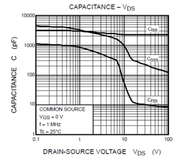
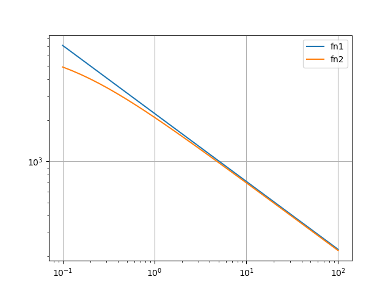
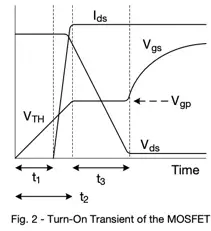

The depletion layers of the MOSFET have parasitic capacitance which changes with bias voltage.
The capacitors are charged and discharged during each switching cycle.

see https://epc-co.com/epc/Portals/0/epc/documents/application-notes/AN030%20Hard%20Switching%20Losses%20Calculation.pdf

During SW fall (HS turn-off):
* Charging Coss_hs through inductor, no energy loss
* Coss_ls is discharged through inductor, no energy loss

During switch node rise (HS turn-on):
* Energy in Coss_hs is dissipated through its own channel
* Coss_ls is charged, loss through HS resistance

Capacitor charging:
* Inductive charging is loss less
* Resistive charging has a loss of half the energy stored in the capacitor

Datasheets:
* usually provide Coss at half of the break-down voltage, some Qoss
* some datasheets provide a Coss_ER (energy related) and Coss_TR (time related), e.g. IRF100B202
  * Coss_ER is slightly lower (up to 10% ?) than Coss_TR


Toshibas AN: https://toshiba.semicon-storage.com/info/application_note_en_20230209_AKX00063.pdf?did=13415
"Ciss is the input capacitance, Crss is the reverse transfer
capacitance, and Coss is the output capacitance.
Capacitances affect the switching performance of a power
MOSFET."

"Effective output capacitance (energy related):
Co(er) is a fixed capacitance that gives the same stored energy as Co"

"Co(tr) is a fixed capacitance that gives the same charging time as Coss while VDS is rising from 0 V to specified voltage."

"For the power MOSFET, the input capacitance (Ciss=Cgd+Cgs), the output capacitance (Coss=Cds+Cgd) and the reverse transfer capacitance (Crss=Cgd) are important characteristics."

"Co(tr) is used in the resonant converter deadtime calculation." https://community.infineon.com/t5/MOSFET-Si-SiC/Which-Coss-value-should-I-use/td-p/778654#.



Coss - Vds dependency:
* Coss(Vds) can be approximated with an inverse square root:
  * Coss(Vds) = Coss(100V) * sqrt(100V/Vds)
* Integrating Coss(vds) over Vds gives us Qoss(Vds)
* Integrating vds*Coss(vds) over Vds gives us the energy stored
  * 2/3 * Coss(Vds) * Vds^2

## Energy stored in a non-linear capacitor

Coss depends on Vds, so the usual formula 1/2 * C * V^2 doesn't work, as we need to integrate over C(V).
Datasheets usually contain capacitance over Vds diagrams, however chart reading is not yet implemented.

We can approximate C(V) = C0 * sqrt(V0/V).
Datasheets usually provide C0=C(V0=Vbr/2) with Vbr = break-down voltage.
With c0' = C0 * sqrt(V0):
C(V) = c0'/sqrt(V)

there is a more precise formular fn2: C(V) = c0/sqrt(1+V/V0). This has a slightly flatter curve at
low voltages (and has finite at zero). We ignore this error and slightly overestimate the capacity at lower voltages.


fn1 is the approximation we use.

By integrating the capacity curve times v we get the energy stored in the capacitor:
```
Eoss = 2/3 * C0 * Vds^1.5 * V0^0.5
```
and in case of V0=Vds:
```
Eoss = 2/3 * C0 * Vds^2
```

As mentioned above, charging HS has zero loss (inductive), but all its charge is lost
during turn-on in its own channel. LS charge is recuperated to the load, but charging it through a resistive
path has losses.

We can compute these by subtracting the Eoss from the total bus energy:

```
E_res = Ebus - Eoss
```

with

```
Ebus = Vbus * Qoss
```

and Qoss by integrating C(V) over 1..Vds (with the approximation we can't integrate from 0..):

```
Qoss = integral(C0*sqrt(V0/v), v=0..Vds)
Qoss = 2*C0 * sqrt(V0) * sqrt(Vds) 
Qoss = 2*C0 * Vds 
```

thus (Vbus=Vds)

```
E_res = Vds * 2*C0*Vds - 2/3 C0 * Vds^2
E_res = 4/3 * C0 * Vds^2 
```
or
```
E_res = 4/3 * C0 * sqrt(V0) * Vds^(3/2)
```
Notice that energy lost in the resistor (E_res) is double the energy stored in the capacitor (Eoss).
For linear capacitors with constant C these are usually equal (Eoss=E_res). 

TODO plot

https://elprivod.nmu.org.ua/files/converters/Robert_Erikson_fundamentals-of-power-electronics-3n_2020.pdf#page=138


https://www.ti.com/lit/an/slpa009a/slpa009a.pdf#page=8

Low-side: charge is recovered during dead-time (not lost)

High-side:
https://elprivod.nmu.org.ua/files/converters/Robert_Erikson_fundamentals-of-power-electronics-3n_2020.pdf#page=137

https://www.onsemi.jp/download/data-sheet/pdf/nvmfws2d1n08x-d.pdf



| V  | C      | C√V  |
|----|--------|------|
| 0  | 4000pF |      |
| 20 | 1800pF | 8000 |
| 30 | 1300pF | 7120 |
| 40 | 1100pF | 6960 |
| 50 | 900pF  | 6360 |
| 70 | 700pF  | 5860 |

C0 = 4000pF
V= 3.3V


# TODO
* use more precise formular for C(V) = C0/sqrt(1+v/v0)
* datsheets usually provide Coss at half the break-down voltage
* https://www.eevblog.com/forum/projects/proof-mosfet-datasheets-lie-to-you!/
* Coss hysteresis ? https://de.slideshare.net/MichaelHarrison96/coss-hysteresis-in-advanced-superjunction-mosfets-apec-2016-presentation-compressed